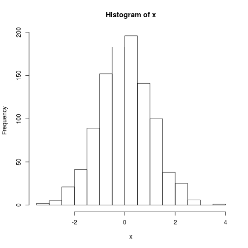

---
output:
  md_document:
    variant: markdown_github
---


## Introduction

this is a test of travis-automated execution.


```r
x <- rnorm(1e03)
summary(x)
```

```
    Min.  1st Qu.   Median     Mean  3rd Qu.     Max. 
-3.22200 -0.67070  0.01242  0.01029  0.65920  3.64600 
```

```r
hist(x)
```



